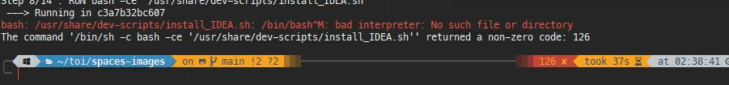

# Official images for [itopia Spaces](https://itopiaspaces.com)

FIX WINDOWS DOCKER DESKTOP ISSUES:

bash: /usr/share/dev-scripts/install_OpenJDK_8_on_Ubuntu_focal.sh: /bin/bash^M: bad interpreter: No such file or directory
The command '/bin/sh -c bash -ce '/usr/share/dev-scripts/install_OpenJDK_8_on_Ubuntu_focal.sh'' returned a non-zero code: 126

see Example : openJDK +IDEA

docker build . 

